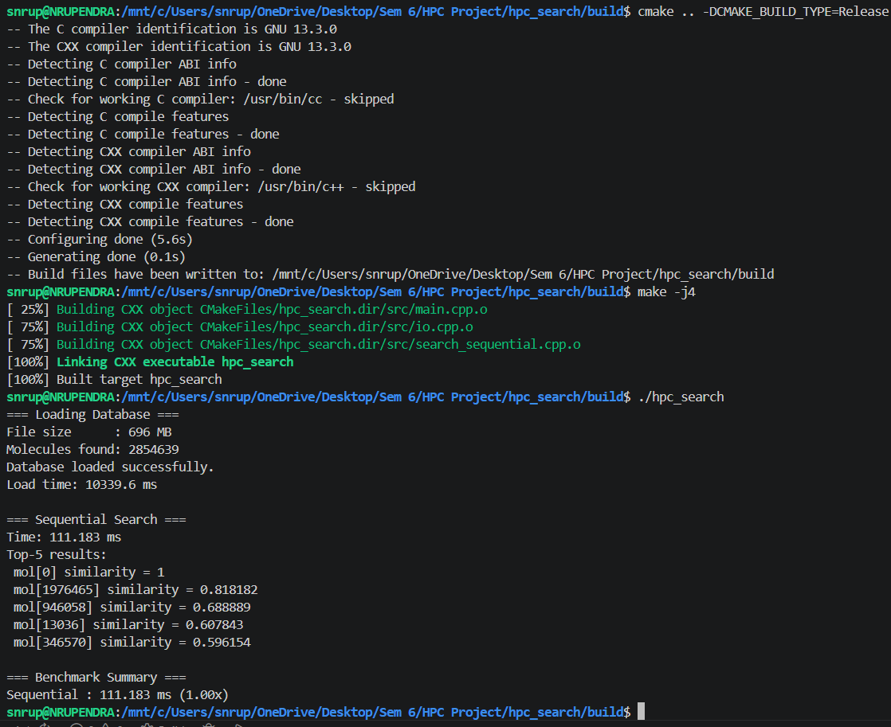
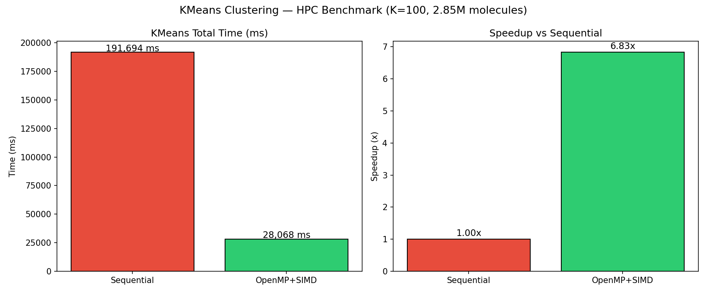
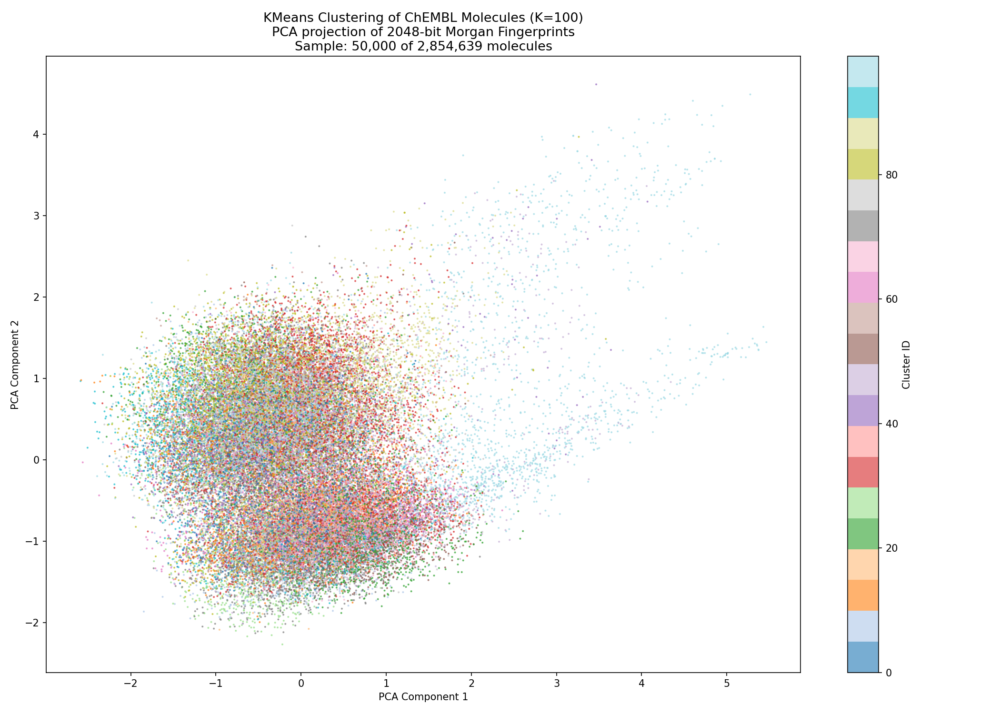

Title : Parallel Vector Similarity Search Engine ("The GenAI Backend")

Deatils about the Project :
What we are building :
A fast search engine for vectors. Given a database of millions of high-dimensional vectors (think: text embeddings, image features), you want to find the K most similar ones to a query vector. This is exactly what powers RAG in LLMs — when ChatGPT "looks up" relevant documents, this is happening under the hood.

The core problem
Brute-force search over 10 million vectors × 128 dimensions = ~1.28 billion float operations per query. That's too slow sequentially. So we parallelize it.

Industry Relevance: Vector databases (like Pinecone or Milvus) are the backbone of modern AI, specifically for Retrieval-Augmented Generation (RAG) used by LLMs to "remember" documents.

The Project: Build a system that loads a massive dataset of high-dimensional vectors (representing text or images) and quickly finds the 'K' most similar vectors to a user's query using Cosine Similarity or Euclidean distance.

Where the HPC comes in: Searching a database of 10 million vectors sequentially takes forever. Using the concepts of HPC we parallelize this search.

For this project we are using Chemistry Dataset instead of official datasets like SIFT1M ( http://corpus-texmex.irisa.fr/)

Local (WSL)  → Step 1: I/O & Architecture
             → Step 2: Sequential baseline  
             → Step 3: OpenMP
             → Step 4: SIMD/AVX

Kaggle GPU   → Step 5: CUDA (Future Enhancement)

Step 0 : Data Preprocessing
* We are using a Chemistry Dataset (https://ftp.ebi.ac.uk/pub/databases/chembl/ChEMBLdb/latest/)
* Using the Python library `rdkit` we are able to obtain fingerprints for different molecules and `.bin` file
* We are considering `chembl_id` (Unique ID for each molecule) and `canonical_smiles` (Text representation of the molecule's chemical structure)


Step 1 : I/O Architecture
1) We need to load the data into memory(the .bin file)
2) Define the data structures everyone will use
3) Write a slow but correct sequential search as baseline
4) Measure how long it takes -> this becomes our "1x" reference
    Order:
        1) `include/fingerprint_db.h` — Shared Data Structures
        2) `src/io.cpp` - Loading the Binary File
        3) `src/search_sequential.cpp` — Brute Force Search
        4) `src/main.cpp` - Entry Point & Timer
        5) `CMakeLists.txt` - Build Instructions
            * This tells cmake how to compile everything
            * -O2 → compiler optimizations on
            * -mavx2 → enable AVX2 instructions (needed for SIMD later)
            * -fopenmp → enable OpenMP (needed for parallel later)
            * Compile the 3 files together into one program called `hpc_search`

Tanimoto Calculation : `number_of_1bits(A & B) / number_of_1bits(A | B)`

`
# Go back to the right place
cd "/mnt/c/Users/snrup/OneDrive/Desktop/Sem 6/HPC Project/hpc_search"

# Create build folder inside hpc_search
mkdir -p build && cd build

# Now cmake can find src/ correctly
cmake .. -DCMAKE_BUILD_TYPE=Release
make -j4
./hpc_search
`

Step 2: OpenMp
With sequential we are computing Tanimoto One molecule at a time, on one CPU Core, where as all the other cores sitting idle while this happens

Using OpenMp we will utilize all the cores available in CPU.

If a CPU has 8 Cores :
`
Core 1 → molecules 0       to 356829
Core 2 → molecules 356830  to 713659
Core 3 → molecules 713660  to 1070489
Core 4 → molecules 1070490 to 1427319
Core 5 → molecules 1427320 to 1784149
Core 6 → molecules 1784150 to 2140979
Core 7 → molecules 2140980 to 2497809
Core 8 → molecules 2497810 to 2854638
`

By adding just one line `#pragma omp parallel for`

The Tricky Part — Race Conditions
Here's the problem. In sequential search, one thread updates the heap:
`Thread 1: sim=0.82 → heap is full → pop lowest → push 0.82 ✓`
With multiple threads doing this simultaneously:
`
Thread 1: sim=0.82 → checks heap → decides to push...
Thread 2: sim=0.91 → checks heap → decides to push...
Thread 1: pushes  → heap now corrupted ← RACE CONDITION
Thread 2: pushes  → wrong result
`
Two threads writing to the same heap at the same time = corrupted data = wrong results.

How We Solve It — Local Heaps
Each thread gets its own private heap:
`
Thread 1 → searches its chunk → builds local top-5
Thread 2 → searches its chunk → builds local top-5
Thread 3 → searches its chunk → builds local top-5
...
Thread 8 → searches its chunk → builds local top-5
`
Then at the end, one thread merges all 8 local top-5 heaps into one final top-5:
`8 local heaps (each size 5) → merge → 1 final heap (size 5)`
This is safe because no two threads ever touch the same heap.

Full Flow :
    1. Split 2.85M molecules across T threads
    2. Each thread:
        a. Creates its own local min-heap of size K
        b. Loops through its chunk
        c. Computes tanimoto for each molecule
        d. Updates its local heap if score is high enough
    3. Main thread merges all local heaps
    4. Return final top-K

Output Observation :


Why 3.26x and not 8x?
We might wonder — if OpenMP uses multiple cores, why not a perfect 8x speedup? This is explained by Amdahl's Law (which you studied in HPC theory):
Reasons for less than perfect speedup:
1. WSL overhead — We running on Windows Subsystem for Linux. WSL doesn't give full native Linux performance. Thread management is slower than bare metal Linux.
2. Memory bandwidth bottleneck — All threads are reading from the same 696MB file in RAM simultaneously. RAM has limited bandwidth — all cores compete for it, so they end up waiting on memory, not computing.
3. Merge overhead — After parallel search, one thread merges all local heaps. That part is sequential.
4. Thread creation cost — Spawning and synchronizing threads has a fixed overhead every time you call search_openmp().
In a real Linux machine we'd likely see 5-7x. 3.26x on WSL is completely reasonable and expected.

Step 3: SIMD/AVX
OpenMP made the loop parallel — more molecules processed simultaneously across cores.

SIMD makes each individual tanimoto calculation faster —
    Instead of processing one uint64 word at a time inside the tanimoto function,
    AVX processes 4 uint64 words simultaneously in one CPU instruction.

With AVX2 + POPCNT we process multiple words per iteration — fewer iterations, faster per molecule.

```
OpenMP  → parallel across molecules  (3.26x so far)
SIMD    → faster per molecule        (expect additional 1.5x - 2x)
Combined → expect ~5-6x total over sequential
```

How SIMD Works :
SIMD Stands for `Single Instruction, Multiple Data`
The CPU has Special Wide Registers
Normal CPU register = 64 bits wide → holds 1 uint64
AVX2 register = 256 bits wide → holds 4 uint64s at once
Normal register:  [ uint64_0 ]                         ← 64 bits
AVX2 register:    [ uint64_0 | uint64_1 | uint64_2 | uint64_3 ]  ← 256 bits
So when you do AND or OR on an AVX2 register, you're doing it on 4 numbers simultaneously with one instruction.


Why Only 2.01x Instead of Expected 5-6x?
Three reasons:
1. The bottleneck is memory, not compute
Reading 696MB of fingerprints from RAM is the slow part. Whether you compute tanimoto in 8 iterations or 32, you still have to wait for RAM to deliver the data. This is called memory bound behaviour — the CPU is faster than RAM can feed it.
2. Compiler already optimized the sequential version
With -O2 flag, the compiler is smart enough to auto-vectorize simple loops. So your "sequential" tanimoto was already partially using SIMD under the hood without you writing it explicitly. Your explicit AVX2 code doesn't add much on top of that.
3. WSL overhead
WSL adds overhead to everything — thread management, memory access patterns, CPU affinity. On a bare Linux machine with more cores you'd see better numbers.

Final Result and Visualtzation :
Using KMeans and taking 100 different Centriods and iterating for a maximum of 20 loops and stopping early if the centroid didn't changed which saves us compuation time



Plotted evenly sampled 50,000 points using PCA converting higher dimensions into 2D for plotting
